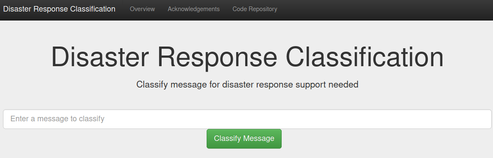

# Disaster Response Classification
## Overview
This is a project that uses dataset of tagged disaster response messages to create a model that will then predict tags
for messages.

## Getting Started:
The following subsections contain instructions to install the app on a local machine and start the application.

### 1. Pull The Repository
Use __git clone https://github.com/Maple-Lazuli/Disaster-Message-Categorization.git__ in the terminal 
to make a copy on the local machine or navigate to the repository directly on github [here](https://github.com/Maple-Lazuli/Disaster-Message-Categorization.git) 
and download the project as an archive.

### 2. Create The Virtual Environment
In the root of the project directory, execute one of the following command sequences based on the OS in use:
1. __Linux/macOS:__
   
   a. _python3 -m pip install --user virtualenv_

   b. python3 -m venv env

2. __Windows:__
   
   a. _py -m pip install --user virtualenv_

   b. py -m venv env
   
### Install The Requirements
Execute __pip install -r requirements.txt__ in the terminal from the root project directory to have pip
install all the dependencies used by this project.

### Process The Dataset And Create The Models (this takes a while)
The machine learning models are too large for github and need to be created. Run the following commands based on
OS to process the data and create the models. (Linux users can alternatively use the start.sh script)

1. __Linux/macOS:__
   
   a. source venv/bin/activate

   b. python data/process_data.py data/disaster_messages.csv data/disaster_categories.csv data/DisasterResponse.db

   c. python models/train_classifier.py data/DisasterResponse.db models/classifier.pkl

2. __Windows:__
   
   a. venv/bin/activate.bat

   b. python data/process_data.py data/disaster_messages.csv data/disaster_categories.csv data/DisasterResponse.db

   c. python models/train_classifier.py data/DisasterResponse.db models/classifier.pkl

### Start The App
Navigate to the app directory by entering __cd app__ in the terminal and execute the run.py in that directory
by entering __python run.py__

### Navigate In The Browser 
After the app starts, it will listen at [0.0.0.0:3001/](http://0.0.0.0:3001/) and allow for messages to be entered
and classified. Just navigate to that link by clicking it or pasting __http://0.0.0.0:3001/__ in the web browser.

## Acknowledgements
The following sources were crucial to the development of this project
1. Udacity - Udacity's Data Scientist course introduced me to Flask as well as variety of natural language processing and machine learning practices that were used in this project.
2. Plotly - Plotly was used to render the graphs and data table seen on the overview page.
3. scikit-learn - scikit-learn was used for the machine learning portions of this project.
4. SQLAlchemy - SQLAlchemy was used to load the dataset after extraction and transformation.
5. Natural Language Tool Kit (NTLK) - NLTK was used for the natural language processing portion of this project
6. Numpy - Numpy was used for numerical computations in the extraction and transformation portion of this project
7. Pandas - Pandas was used for data analysis in the exploratory, extraction, and transformation portions of this project.
